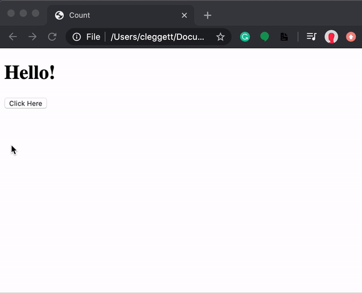
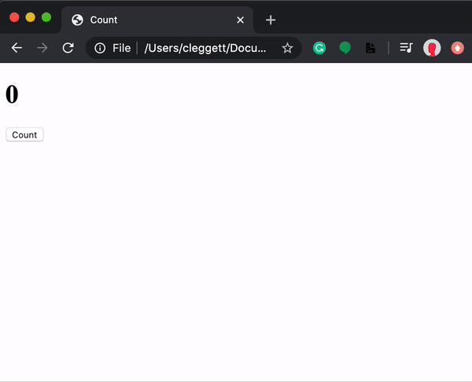

# Lecture 5: JavaScript - Insights/Summarized Notes

### Events

One feature of JavaScript that makes it helpful for web programming is that it supports Event-Driven Programming.

In JavaScript, we use Event Listeners that wait for certain events to occur, and then execute some code.

Let’s begin by turning our JavaScript from above into a function called <kbd>hello</kbd>:

```javascript
function hello() {
    alert('Hello, world!')
}
```

Now, let’s work on running this function whenever a button is clicked. Here we will use an <kbd>onclick</kbd> attribute, which gives the browser instructions for what should happen when the button is clicked:

```HTML
<button onclick="hello()">Click Here</button>
```

### Variables

There are three keywords we can use to assign values in JavaScript:

- <kbd>var</kbd>: used to define a variable globally

```javascript
var age = 20;
```

- <kbd>let</kbd>: used to define a variable that is limited in scope to the current block such as a function or loop

```javascript
let counter = 1;
```

- <kbd>const</kbd>: used to define a value that will not change

```javascript
const PI = 3.14;
```

**Example:**

```HTML
<!DOCTYPE html>
<html lang="en">
    <head>
        <title>Count</title>
        <script>
            let counter = 0;
            function count() {
                counter++;
                alert(counter);
            }
        </script>
    </head>
    <body>
        <h1>Hello!</h1>
        <button onclick="count()">Count</button>
    </body>
</html>
```


### Inbuilt Functions/Methods

We have used functions before. <kbd>alert</kbd> was one of those. We will look into other functions in this section.

#### `querySelector`

 JavaScript allows us to change elements on the page. To do this, we use a function called <kbd>document.querySelector</kbd>.  This function `searches for and returns elements of the DOM`.

**Example:**

We would use,
```javascript
let heading = document.querySelector('h1');
```
to extract a heading. Then, to manipulate the element we’ve recently found, we can change its `innerHTML` property:
```javascript
heading.innerHTML = `Goodbye!`;
```

#### Conditions in Javascript

Just as in Python, we can also take advantage of conditions in JavaScript. 

##### Comparisions types in JavaScript

- We use <kbd>===</kbd> as a stronger comparison between two items which also checks that the objects are of the same type. 
- We use <kbd>==</kbd> as a weak comparison, It doesn't check for the object type.

> We typically want to use <kbd>===</kbd> whenever possible.


For example, let’s say rather than always changing our header to `Goodbye!`, we wish to toggle back and forth between `Hello!` and `Goodbye!`.

Our page might then look something like the one below:

```HTML
<!DOCTYPE html>
<html lang="en">
    <head>
        <title>Count</title>
        <script>
            function hello() {
                const header = document.querySelector('h1');
                if (header.innerHTML === 'Hello!') {
                    header.innerHTML = 'Goodbye!';
                }
                else {
                    header.innerHTML = 'Hello!';
                }
            }
        </script>
    </head>
    <body>
        <h1>Hello!</h1>
        <button onclick="hello()">Click Here</button>
    </body>
</html>
```




### DOM Manipulation

Let’s use this idea of DOM manipulation to improve our counter page:

```HTML
<!DOCTYPE html>
<html lang="en">
    <head>
        <title>Count</title>
        <script>
            let counter = 0;
            function count() {
                counter++;
                document.querySelector('h1').innerHTML = counter;
            }
        </script>
    </head>
    <body>
        <h1>0</h1>
        <button onclick="count()">Count</button>
    </body>
</html>
```


### Using Template Literals

We can format a string to customize the message using template literals. Template literals requre that there are backticks <kbd>\`\`</kbd>around the entire expression and a <kbd>$</kbd> and curly braces <kbd>{}</kbd> around any substitutions.

For example, let’s change our count function

```javascript
function count() {
    counter++;
    document.querySelector('h1').innerHTML = counter;
    
    if (counter % 10 === 0) {
        alert(`Count is now ${counter}`)
    }
}
```


### querySelector for choosing the h1 tag and then changing the text inside it. Equals to variable.
document.querySelector('h1').innerHTML = counter;

### Attaching a function to an element's property using querySelector.
document.querySelector('button').onclick = count;

where button is an element and onclick is it's property. conut is a function that is deemed to be triggered.


### Event listener for checking the document is properly loaded and then executing the task assigned to it.

document.addEventListener('DOMContentLoaded', function() {
	document.querySelector('button').onclick = count;
})

this event listener wrapper ensures that the button linking function should only be executed when the whole document is loaded in the browser.

### Having a seperate javescript file to split out the work.

<script src="conter.js"></script>

and then in counter.js we have

let counter = 0;

function count (){
	counter++;
	document.queryselector('h1').innerHTML = counter;

	if (counter % 10 == 0) {
		alert(`Count is now ${counter}`)
	}
}


document.addEventListener('DOMContentLoaded', fucntion() {
	document.querySelector('button').onclick = count;
});


### Getting the form data using javascript and operating on it.
```javascript
document.addEventListener('DOMContentLoaded', function() {
    document.querySelector('form').onsubmit = function() {
        const name = document.querySelector('#name').value;
        alert(`Hello, ${name}`);
    };
});
```

Where #name inside the document.querySelector is used to find an element with an id of name. same as we do in CSS.

We use the value attribute of an input field to find what is currently typed in.


### Changing the style of a id tagged HTML

document.querySelector("#hello").style.color = button.dataset.color;


### Setting the data atttribute to the HTML elements which can be used in further processing the functions.

<button data-color="red">RED</button>

javascript:

button.onclick = function() {
    document.querySelector("#hello").style.color = button.dataset.color;
}

where we styled the hello id element with the color that the button has labelled with. extracting the data from button element using: button.dataset.color


## API

An API, or Application Programming Interface, is a structured form communication between two different applications.

## JavaScript Objects

One way in which JavaScript Objects are really useful is in transferring data from one site to another, particularly when using APIs

## JSON (JavaScript Object Notation)

we may want our application to get information from Google Maps, Amazon, or some weather service. We can do this by making calls to a service’s API, which will return structured data to us, often in JSON (JavaScript Object Notation) form. For example, a flight in JSON form might look like this:

{
    "origin": "New York",
    "destination": "London",
    "duration": 415
}


## AJAX (Asynchronous JavaScript And XML)

AJAX, or Asynchronous JavaScript And XML, which allows us to access information from external pages even after our page has loaded. In order to do this, we’ll use the fetch function which will allow us to send an HTTP request. The fetch function returns a promise. We won’t talk about the details of what a promise is here, but we can think of it as a value that will come through at some point, but not necessarily right away. We deal with promises by giving them a .then attribute describing what should be done when we get a response. The code snippet below will log our response to the console.


document.addEventListener('DOMContentLoaded', function() {
    // Send a GET request to the URL
    fetch('https://api.exchangeratesapi.io/latest?base=USD')
    // Put response into json form
    .then(response => response.json())
    .then(data => {
        // Log data to the console
        console.log(data);
    });
});


### Acronyms studied

> - JSON : Java-Script Object Notation
> - APIs : Application Programming Interface
> - AJAX : Asynchronous JavaScript And XML